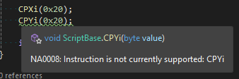
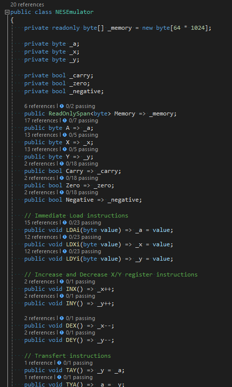
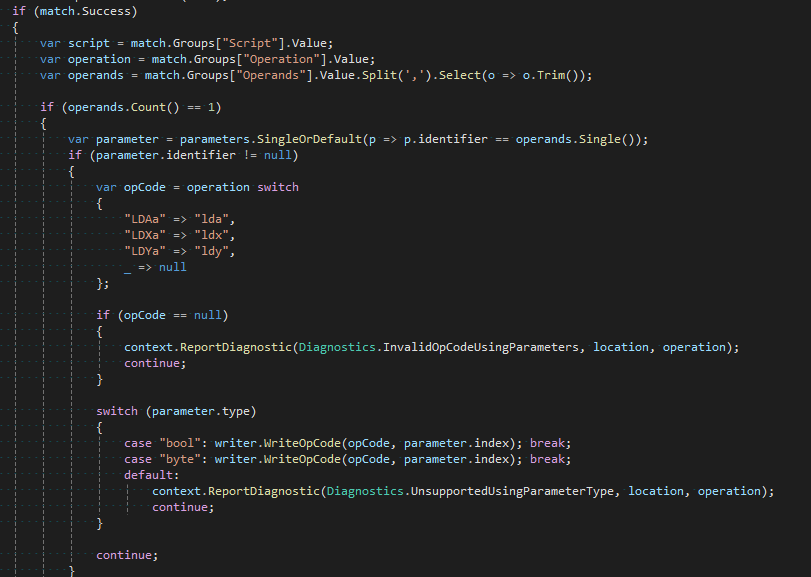

# NesAsm

NES Emulator and 6502 scripting toolkit for C#

The goal of NesAsm is to make writing games for the NES accessible to more people.

# Setup 

- Need to install ca65 (put in Path?)
- Need to put Mesen in Path

# What does it do?

## Write ASM code but in C#
- Access to intellisense, documentation on OpCodes

- Get warnings or errors when you do something wrong

## Use basic C# code instead of ASM
- [TBD] use if, for, while statements (maybe simple switch statement)
- Call C# methods, pass parameters and use return values

- [TBD] use local variables
- [TBD] Create macro methods to be generate inline instead of subroutines

## Mix C# with ASM code seemlessly for compilation into a rom file
- Include C# file in the compilation (after ASM code generation)

- [TBD] Include ASM .s file to be access to and from C# code 

## Debug your game inside Visual Studio or VSCode
- [TBD] Even ASM code with the auto generated C# code 
- [TBD] Inspect the current state of registry, CPU and PPU memory
- [TBD] Tool to visualize what is loaded in the PPU
- [TBD] Fully functional emulator to play the game

## Test your code with unit tests
- Use any test framework you want to validate your code

- [TBD] Access to the emulator state when you write your test
- [TBD] Save, load or craft state to help with test setup

## Test your code with frame output tests
- [TBD] Use the emulator PPU output to validate current palettes, OAM, pattern, attribute or name tables

## Include graphics
- [InProgress] Use .png file for graphics
- [InProgress] Create palette from imported .png file
- [TBD] Map tiles and meta tiles from imported .png file

# How does it works

## ScriptBase base class to access all the Apis and utilities
- All script code must inherit from the ScriptBase class
- [WIP] All 6502 OpCodes can be accessed through that base class

## NESEmulator class
- [WIP] The NESEmulator class is a real C# emulator with accessible apis to help in testing and debugging your game

## Source Generator
NesAsm use [Source Generator](https://learn.microsoft.com/en-us/dotnet/csharp/roslyn-sdk/source-generators-overview) to generate ASM code and C# code. It also allow to give feedback when you write code like when using C# that can't be converted to ASM or bad usage of an Api.

## External ASM compiler
To compile ASM code to .nes rom file NesAsm rely on https://cc65.github.io/

# References

https://www.youtube.com/@NesHacker
https://github.com/NesHacker
https://github.com/Xyene/Emulator.NES/tree/master
https://www.middle-engine.com/blog/posts/2020/06/23/programming-the-nes-the-6502-in-detail
https://github.com/EliotJones/BigGustave